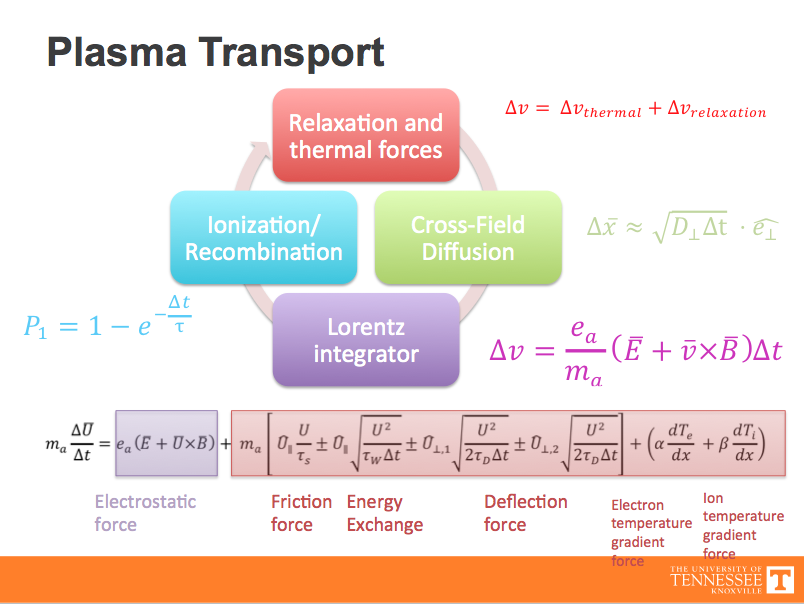

# GITR
Global Impurity Transport Code

## Description
The GITR program takes a background plasma profiles, equilibrium, geometry, and surface model and performs large scale simulation of plasma induced erosion, plasma transport of those impurities, self-sputtering, and redeposition.

The physics implemented in GITR is based on the trace-impurity assumption. i.e. The density of impurities created in the GITR code is negligible in its effect on the background plasma parameters.


The code is manifested in the time stepping of a particle with a set of initial conditions through a set of operators until certain conditions on the particles are reached (crossing a boundary or timing out). The operators acting on the particles are dependent on the prescibed fields and profiles of the background.



## Program Files
The program is organized into C++, matLab, and python files. The C++ are the buildable program (located in src and include directories), with the matlab scripts (located in the matlab directory) being used to generate inputs, run benchmarks, and post process outputs. The build directory contains scripts used to compile the GITR executable via passing cmake arguments.
```
. (Makefile, machine environment files, etc.)
├── build (Contains sh scripts used to compile GITR by passing cmake the proper arguments executable is built here)
├── cmakeMachineFiles (example CMake files for different machines and configurations)
├── examples (operator tests and simulation setup examples)
├── ftridyn (python programs and scripts for producing surface models and processing F-TRIDYN output)
├── include (C++ header files)
├── matlab (matlab utility scripts)
├── python (python scripts for plotting and testing)
├── src (C++ source files)
└── tests (regression test cases with reference solutions)
```
## Dependencies 

### Libconfig (https://github.com/hyperrealm/libconfig) [v1.7.1 tested]
The human readable input files are of the format defined by the libconfig API. Libconfig can be found at the above location on github.

### NetCDF-C (https://github.com/Unidata/netcdf-c) [v4.5.0 tested]
We utilize the netcdf file format for both inputs and outputs.

### NetCDF-CXX4 (https://github.com/Unidata/netcdf-cxx4) [v4.3.0 tested]
We further utilize the more recent CXX-4 components of the NetCDF API (note that the --enable-cxx4 flag is not required as suggested in the netcdf-cxx4 github readme file).  

### THRUST (https://github.com/thrust/thrust) [1.8.2 tested] or CUDA (https://developer.nvidia.com/cuda-downloads) [Cuda 8 tested]
The THRUST headers are required and are available either standalone from the THRUST repo (for building on systems without GPUs), or from within the CUDA SDK (for building on systems with GPUs). So if you do not have an nvidia compute GPU, you will still need the THRUST library (unbuilt).

## Installation
We utilize a simple machine specific makefile to specify the locations of the above dependencies. To build GITR on a new machine you will need to create a copy of an existing file (e.g., `cmakeMachineFiles/CMakeLists.txt`) with the name of your machine as the extension. This can be done via 

`cp machine-makefiles/Makefile.dlg-macpro machine-makefiles/$(uname -n)`

and then editing the resulting file appropriately. Then just 

```
make clean
make
make test
```
Inputs to the code are set up in the gitrInput.m file and include
1. Volume specification and gridding
2. Surface parameterization and gridding
3. Background fields and profiles
4. Number of particles and initial conditions
5. Time stepping information
6. Desired output

There also exists a folder for processing output data /matlab/PostProcessing and a postProcessing.m routine to be run in order to produce plots of desired output.


#gpufusion.ornl.gov

source env.gpufusion.sh
make

### Build Options
The THRUST API provides for single thread CPU (CPP), multi thread OpenMP (OMP), and CUDA (CUDA) targets via the appropriate choice of THRUST policy. Within the top level `Makefile` the THRUST policy (which selects either CPU, OPENMP, or GPU) is selected by uncommenting the desired choice as 

```
# Select only one.

USE_SERIAL:= 0
USE_CUDA  := 0
USE_OPENMP:= 1
 ```
Also, various code features and debugging levels can be enabled at build time by enabling any of the following within the top level `Makefile`. 

```
# Features
CPPFLAGS += -DCYLINDRICAL_INPUT_FIELDS=1 # Are the input (NetCDF) fields in Cylindrical or not. 
CPPFLAGS += -D_PARTICLE_BOUNDARY=1 # 1 = particle absorbing walls, 2 = periodic, 3 = reflective
CPPFLAGS += -DGC_ORBITS=0 # Use Guiding Center evalulation (Not yet functional)
CPPFLAGS += -DCOMPLEX_WRF=0 # Use the complex omega as the time integral decay time, as opposed to the Hanning window.  

# Non THRUST Implementations
CPPFLAGS += -DDO_CPU_ITERATOR_APPROACH=0
CPPFLAGS += -DDO_CPU_APPROACH=0

# Timing Info
CPPFLAGS += -DUSEPAPI=0
CPPFLAGS += -DLOWMEM_USEPAPI=0
CPPFLAGS += -DCLOCK=1
CPPFLAGS += -DPRINT_INFO=1

# Debug Info Level
CPPFLAGS += -DDEBUG_GC=0
CPPFLAGS += -DDEBUG_EVAL_VGC=0
CPPFLAGS += -DDEBUG_EVAL_APAR=0
CPPFLAGS += -DDEBUGLEVEL=0
CPPFLAGS += -DDEBUG_LINES=0
CPPFLAGS += -DDEBUG_INTERP=0
CPPFLAGS += -DDEBUG_MAXWELLIAN=0
CPPFLAGS += -DDEBUG_FORCE_TERM=0
CPPFLAGS += -DDEBUG_MOVE=0
CPPFLAGS += -DDEBUG_ROTATION=0
CPPFLAGS += -DDEBUG_INTVECARRAY=0
CPPFLAGS += -DDEBUG_READ_E_FIELD=0

# File Write Options
CPPFLAGS += -DLOWMEM_ORBIT_WRITE=0
CPPFLAGS += -DF1_WRITE=0
```

## Specific Machine Build Notes

### edison.nersc.go
```
source env-edison.sh
make clean
make
make test # (although you're better off running the tests on the compute nodes as described below)
```

### gpufusion.ornl.gov

```
source env-gpufusion.sh
make clean
make
make test
```

## Running Kinetic-J
Set a `KINETICJ_ROOT` environment variable to be the location of the cloned source ...
```
cd ~/code
git clone https://github.com/ORNL-Fusion/kineticj.git
export KINETICJ_ROOT=~/code/kineticj
```

### Run the regression tests
To aid development testing we include some simple regression testing. This is run as follows (or via `make test`) ...
```
cd $KINETICJ_ROOT/tests
python ../python/kj_test.py
```
or at NERSC ...
```
cd $KINETICJ_ROOT
source env-edison.sh
cd $SCRATCH
mkdir kineticj
cp -r $KINETICJ_ROOT/tests .
cd tests
salloc -N 1 -p debug
python $KINETICJ_ROOT/python/kj_test.py
exit
```
with the expected output being ...
```
python $KINETICJ_ROOT/python/kj_test.py

benchmark1-00007    PASS [2.9 seconds]
benchmark2-00013    PASS [2.5 seconds]
benchmark3-00004    PASS [4.2 seconds]
test4               PASS [3.4 seconds]
```

### Run the test case
A standalone test case is also availble where we demonstrate the current response for a variable magnetic field (1/r) where the fundamental and 2nd harmonic ion cyclotron resonances are in the domain (at x=1.75 and x=3.5 respectively). We have provided an input file `template/input/input-data.nc` with an electric field with `kx=pi/(2*rho_L)` where `rho_L` is the Lamor radius at the location of the 2nd harmonic resonance, i.e., the finite Lamor radius interaction is captured per pg.270-271 of Stix. This case is run via the following commands ...

```
cd $KINETICJ_ROOT
cd template
./bin/kineticj
python ../python/kj_plot.py
```

or for NERSC (Edison with a single node using OpenMP)

```
cd $KINETICJ_ROOT
source env-edison.sh
cd $SCRATCH
mkdir kineticj
cp -r $KINETICJ_ROOT/template .
cd template
salloc -N 1 -p debug
$KINETICJ_ROOT/bin/kineticj
exit
python $KINETICJ_ROOT/python/kj_plot.py
```


Changing the variables in `template/kj.cfg` will allow experimenting with running the code. 

```
  1 xGridMin = 1.0;
  2 xGridMax = 5.0;
  3 nXGrid = 200
  4 nRFCycles = 50.0;
  5 species_number = 0;
  6 species_amu = 1.0;
  7 species_Z = 1.0;
  8 runIdent = "template";
  9 nP_Vx = 5;
 10 nP_Vy = 5;
 11 nP_Vz = 5;
 12 nThermal = 3;
 13 nPhi = 0;
 14 ky = 0.0;
 15 T_keV = 5.0;
 16 input_fName = "input/input-data.nc";
 17 kz = 0.0;
 18 nStepsPerCyclotronPeriod = 30.0;
```

## Other Information

