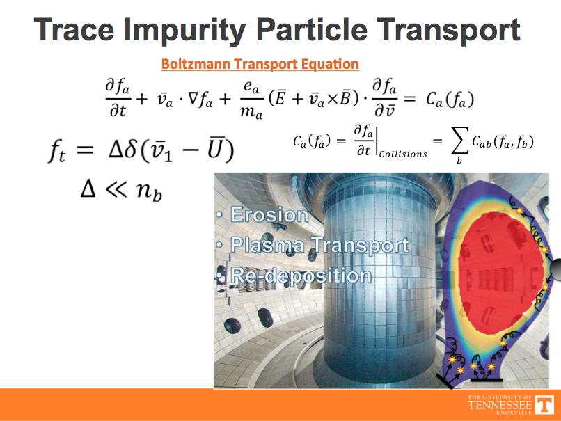
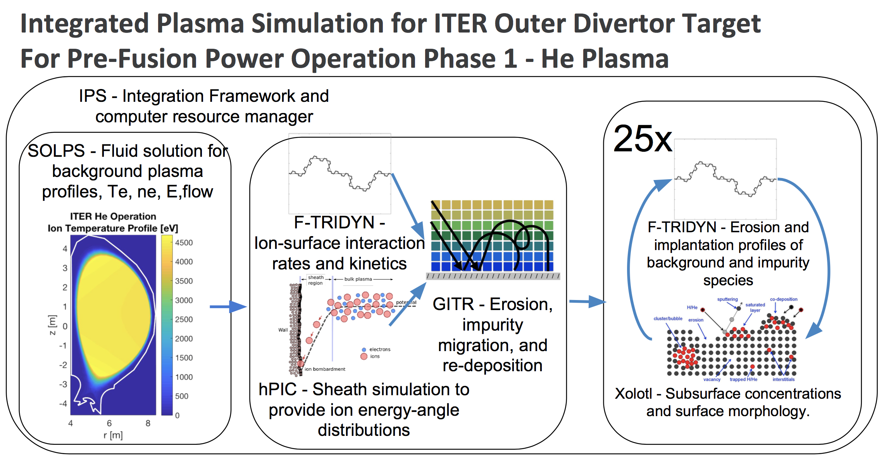

# GITR
Global Impurity Transport Code

## Description
The GITR program takes background plasma profiles, equilibrium, geometry, and surface model and performs large scale simulation of plasma induced erosion, plasma transport of those impurities, self-sputtering, and redeposition.

The physics implemented in GITR is based on the trace-impurity assumption. i.e. The density of impurities created in the GITR code is negligible in its effect on the background plasma parameters.



The code is manifested in the time stepping of a particle with a set of initial conditions through a set of operators until certain conditions on the particles are reached (crossing a boundary or timing out). The operators acting on the particles are dependent on the prescibed fields and profiles of the background.



## Program Files
The program is organized into C++, matLab, and python files. The C++ are the buildable program (located in src and include directories), with the matlab and python scripts (located in the matlab/python directory) being used to generate inputs, run benchmarks, and post process outputs. The build directory contains scripts used to compile the GITR executable via passing cmake arguments.
```
. (CMakeLists.txt, machine environment files, etc.)
├── build (Contains sh scripts used to compile GITR by passing cmake the proper arguments executable is built here)
├── cmakeMachineFiles (example CMake files for different machines and configurations)
├── examples (operator tests and simulation setup examples)
├── ftridyn (python programs and scripts for producing surface models and processing F-TRIDYN output)
├── include (C++ header files)
├── matlab (matlab utility scripts)
├── python (python scripts for plotting and testing)
├── src (C++ source files)
└── tests (regression test cases with reference solutions)
```
## Dependencies 

cmake version 3.1 or newer required

### Libconfig (https://github.com/hyperrealm/libconfig) [v1.7.1 tested]
The human readable input files are of the format defined by the libconfig API. Libconfig can be found at the above location on github.

### NetCDF-C (https://github.com/Unidata/netcdf-c) [v4.5.0 tested]
We utilize the netcdf file format for both inputs and outputs.

### NetCDF-CXX4 (https://github.com/Unidata/netcdf-cxx4) [v4.3.0 tested]
We further utilize the more recent CXX-4 components of the NetCDF API (note that the --enable-cxx4 flag is not required as suggested in the netcdf-cxx4 github readme file).  

### THRUST (https://github.com/thrust/thrust) [1.8.2 tested] or CUDA (https://developer.nvidia.com/cuda-downloads) [Cuda 8 tested]
The THRUST headers are required and are available either standalone from the THRUST repo (for building on systems without GPUs), or from within the CUDA SDK (for building on systems with GPUs). So if you do not have an nvidia compute GPU, you will still need the THRUST library (unbuilt).

### Boost (https://www.boost.org) [1.61 tested]
The Boost headers are required and although Boost is a very large library a subset of the library can be installed. After downloading boost.
```
./bootstrap.sh --with-toolset=gcc --prefix=/directory/for/boostBuild/ --with-libraries=system,filesystem,chrono,timer

vi tools/build/src/user-config.jam ##to add the following line
using gcc : : /opt/local/bin/gcc ;


./b2 link=shared,static cxxflags="-std=c++14" install
```

## Installation
We utilize a simple machine specific makefile to specify the locations of the above dependencies along with a shell script to pass the proper options to cmake. To build GITR on a new machine you will need to create a copy of an existing file (e.g., `cmakeMachineFiles/CMakeLists.txt`) with the name of your machine as the extension. This can be done from the GITR directory via 

`cp cmakeMachineFiles/mac/CMakeLists.txt .`

and then editing the resulting file appropriately. Then we want to copy and modify a makeGITR.sh script  

```
cp cmakeMachineFiles/mac/makeGITR.sh build/
cd build
./makeGITRmac.sh
make
```
Inputs to the code are set up in the input folder of an example run case controlled by the gitrInput.cfg file.
This file inlcudes
1. Geometry file specification
2. Surface parameterization and gridding
3. Background fields and profiles
4. Number of particles and initial conditions
5. Time stepping information
6. Desired output

There also exists a folder for processing output data /matlab/PostProcessing and a postProcessing.m routine to be run in order to produce plots of desired output.


Alternately for building, a python script can be set up to read the input file (gitrInput.cfg) with the appropriate compile flags and then build the code appropriately. These scripts are also found in the cmakeMachineFiles/... folders as runExamples.py

This script must be adapted to have the correct flags for env file, USE_CUDA

Then the python function buildGITR('/directory/case') can be used to build the code for a specific example/run.
```
python
>>> import runExamples
>>> runExamples.buildGITR('../examples/operatorTests/straightLine/2dgeom')
```

### Build Options
The THRUST API provides for single thread CPU (CPP), multi thread OpenMP (OMP), and CUDA (CUDA) targets via the appropriate choice of THRUST policy. Within the top level `CMakeLists.txt` the THRUST policy (which selects either CPU, OPENMP, or GPU) is selected by uncommenting the desired choice as 

Within CMakeLists.txt set CUDA 1 or OPENMP 1

Within the makeGITR.sh file or runExamples.py first set the machine specific compile flags
```
    ##Machine specific flags
    USE_CUDA=0
    USE_MPI=1
    USE_OPENMP=0
    USE_BOOST=1
 ```
 
In some cases cmake needs additional help finding the dependencies and specific arguments should be passed.
The following are examples that could be necessary.
```
-DTHRUST_INCLUDE_DIR=/Users/tyounkin/code/thrust/ \
        -DCMAKE_C_COMPILER=gcc \
        -DCMAKE_CXX_COMPILER=g++ \
        -DNETCDF_CXX_INCLUDE_DIR=$NETCDFCXX4INCLUDE \
        -DNETCDF_CXX_LIBRARY=$NETCDFLIB_CPP \
        -DNETCDF_DIR=$NETCDFDIR \
        -DNETCDF_INCLUDE_DIR=$NETCDFINCLUDE \
        -DNETCDF_LIBRARY=$NETCDFLIB \
        -DNETCDF_CXX_INCLUDE_DIR=$NETCDFCXX4INCLUDE \
        -DLIBCONFIGPP_INCLUDE_DIR=/Users/tyounkin/Code/libconfigBuild/include \
        -DBoost_DIR=/Users/tyounkin/Code/boostBuild \
        -DBoost_INCLUDE_DIR=/Users/tyounkin/Code/boostBuild/include
```
Also, various code features can be enabled at build time by specifying any of the following within the makeGITR.sh file or using the runExamples.py script. 

```
    -DUSEIONIZATION=1 \
    -DUSERECOMBINATION=1 \
    -DUSEPERPDIFFUSION=1 \
    -DUSECOULOMBCOLLISIONS=1 \
    -DUSETHERMALFORCE=1 \
    -DUSESURFACEMODEL=1 \
    -DUSESHEATHEFIELD=1 \
    -DBIASED_SURFACE=0 \
    -DUSEPRESHEATHEFIELD=0 \
    -DBFIELD_INTERP=0 \
    -DLC_INTERP=0 \
    -DGENERATE_LC=0 \
    -DEFIELD_INTERP=0 \
    -DPRESHEATH_INTERP=0 \
    -DDENSITY_INTERP=0 \
    -DTEMP_INTERP=0 \
    -DFLOWV_INTERP=0 \
    -DGRADT_INTERP=0 \
    -DODEINT=0 \
    -DFIXEDSEEDS=0 \
    -DPARTICLESEEDS=1 \
    -DGEOM_TRACE=0 \
    -DGEOM_HASH=0 \
    -DGEOM_HASH_SHEATH=0 \
    -DPARTICLE_TRACKS=1 \
    -DPARTICLE_SOURCE_SPACE=0 \
    -DPARTICLE_SOURCE_ENERGY=0 \
    -DPARTICLE_SOURCE_ANGLE=0 \
    -DPARTICLE_SOURCE_FILE=0 \
    -DSPECTROSCOPY=2 \
    -DUSE3DTETGEOM=0 \
    -DUSECYLSYMM=1 \
    -DUSEFIELDALIGNEDVALUES=1 \
    -DFLUX_EA=1 \
    -DFORCE_EVAL=1 \
    -DCHECK_COMPATIBILITY=1 \
```

## Specific Machine Build Notes

### edison.nersc.gov
```
source env.edison.sh
./cleanGITR.sh
./makeGITR.sh
make
```

### gpufusion.ornl.gov

```
source env.gpufusion.sh
./cleanGITR.sh
./makeGITR.sh
make
```

## Running GITR
In order to run GITR, navigate to the desired run foler which contains the input directory e.g. `GITR/examples/operatorTests/straightLine/2Dgeom` and execute the GITR executable `~/Code/GITR/build/GITR`

In most cases you will want to modify the options in the makeGITR.sh script to match those found in the input/gitrInput.cfg file at the end of the file where the flags are specified:
```
flags = 
{
        USE_CUDA=1;
        USEMPI=0;
        USE_MPI=0;
        USE_OPENMP=0;
        USE_BOOST=1;
        USEIONIZATION=0;
        USERECOMBINATION=0;
        USEPERPDIFFUSION=0;
        USECOULOMBCOLLISIONS=0;
        USETHERMALFORCE=0;
        USESURFACEMODEL=0;
        USESHEATHEFIELD=0;
        BIASED_SURFACE=0;
        USEPRESHEATHEFIELD=0;
        BFIELD_INTERP=0;
        LC_INTERP=0;
        GENERATE_LC=0;
        EFIELD_INTERP=0;
        PRESHEATH_INTERP=0;
        DENSITY_INTERP=0;
        TEMP_INTERP=0;
        FLOWV_INTERP=0;
        GRADT_INTERP=0;
        ODEINT=0;
        FIXEDSEEDS=0;
        PARTICLESEEDS=1;
        GEOM_TRACE=0;
        GEOM_HASH=0;
        GEOM_HASH_SHEATH=0;
        PARTICLE_TRACKS=1;
        PARTICLE_SOURCE_SPACE=0;
        PARTICLE_SOURCE_ENERGY=0;
        PARTICLE_SOURCE_ANGLE=0;
        PARTICLE_SOURCE_FILE=0;
        SPECTROSCOPY=0;
        USE3DTETGEOM=0;
        USECYLSYMM=0;
        USEFIELDALIGNEDVALUES=0;
        FLUX_EA=0;
        FORCE_EVAL=0;
        CHECK_COMPATIBILITY=1;
}
```


### Run the operator tests
In order to run the operator tests the runExamples.py file in the build folder must be properly configured.


### Run the test case


## Other Information

