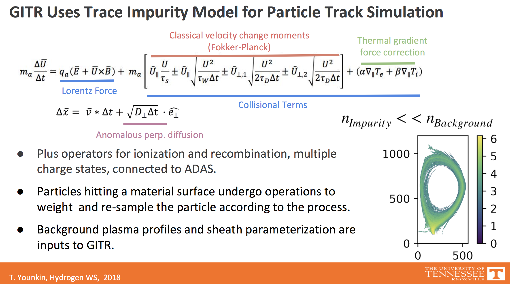
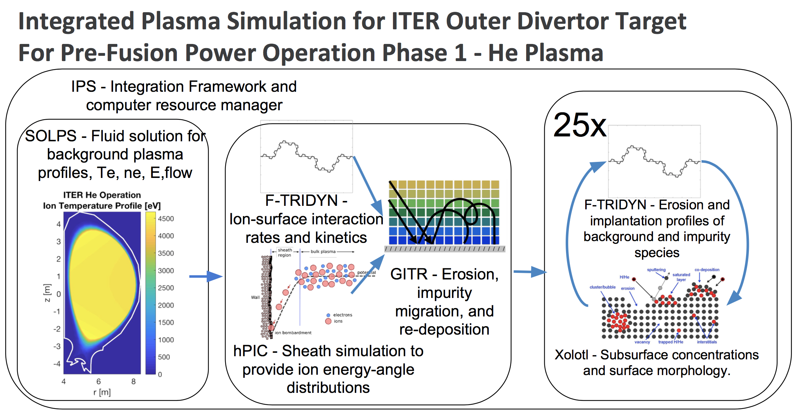

# GITR 
Global Impurity Transport Code

[](https://github.com/ORNL-Fusion/GITR/actions/workflows/cmake.yml)

### Note for legacy GITR users:
For reference, please visit the archived copy of the GITR project - [GITR_legacy](https://github.com/ORNL-Fusion/GITR_legacy)

## Description
The GITR program takes background plasma profiles, equilibrium, geometry, and surface model 
and performs large scale simulation of plasma induced erosion, plasma transport of those 
impurities, sputtering, and redeposition.

The physics implemented in GITR is based on the trace-impurity assumption. i.e. 
The density of impurities created in the GITR code is negligible in its effect on the 
background plasma parameters.

Beginning from a set of initial conditions, the code steps each particle through a set of
operators until certain conditions on the particles are reached (crossing a 
boundary or timing out). The operators acting on the particles are dependent on the prescribed
fields and profiles of the background.







## Directory Layout
```
. Top Level: Top level build system file **CMakeLists.txt**, LICENSE file, README.md (this file)
├── CMake           ---> build system files
├── images          ---> repo visuals for websites and presentations
├── examples        ---> contains a post-processing example script
├── include         ---> C++ header files
├── src             ---> C++ source files
├── test_include    ---> C++ unit test header files
└── test_src        ---> C++ unit test source files
```

## Environment

The GITR software relies on several other software installations to operate. These *dependencies* fall under *system dependencies* and *3rd-party dependencies*. GITR's advanced build system downloads and builds all 3rd-party dependencies automatically, but this is not the case with system dependencies. These must all be installed by the user prior to attempting to build GITR. Numerous approaches are available to the user for installing/updating/managing system dependencies. An approach using the **spack** utility is briefly described below, loosely following https://spack-tutorial.readthedocs.io/en/latest/.

### Ubuntu 20.04

0. Ensure that basic system dependencies like a working compiler are installed and discoverable on your system. If it is a blank system, you will need to install these with the native Ubuntu package manager *apt*:

> apt install build-essential

At this time, HDF5 must also be installed as a system dependency with the native system package manager. It cannot be installed with spack.

> apt install hdf5-hl

1. Download spack: 

> git clone https://github.com/spack/spack.git

2. Instantiate spack in your environment. This can optionally be placed in your .bashrc file if you want it done automatically upon every login:

> source ~/spack/share/spack/setup-env.sh

3. Direct spack to find a compiler to use:

> spack compilers

This command should produce non-empty output. The discovered compilers will be listed.

4. We may now begin using spack to install the rest of the system dependencies. Beginning with the newest version of gcc:

List packages matching *gcc*:
> spack list gcc

List versions of package:

> spack versions gcc

Install one (preferably the latest):

> spack install gcc @11.2.0

> spack load gcc@11.2.0

> spack compiler find

You are building a literal compiler. Expect this to take a

> Very.

> Long.

> Time...

5. Next, we will use the compiler we just built to build the rest of the dependencies:

> spack list cmake

> spack versions cmake

> spack install cmake @3.22.1 %gcc@11.2.0

6. **Optional**: for CUDA support, similarly install CUDA:

> spack list cuda

> spack versions cuda

> spack install cuda @11.5.1 %gcc@11.2.0

7. **Optional** for blazingly fast source compilation, similarly install Ninja build system:

> spack list ninja

> spack versions ninja

> spack install ninja @1.10.2 %gcc@11.2.0

8. Now that these softwares are made available to spack, they must be loaded into the current environment so that they are discoverable in the current environment. List packages and load them:

> spack find -x

> spack find -x --loaded

> spack load gcc

> spack load cuda

> spack load cmake

> spack load ninja

> spack find -x --loaded

This final command should print out all the loaded environments.

### Mac OSx

1. If you do not have the Homebrew package manager, get it here at: https://brew.sh/ 
2. For `brew` to work, you may need to run the following:
> source ~/.bashrc
3. You must install HDF5:
> brew install hdf5@1.12
4. You must install CMake if you do not already have it:
> brew install cmake
5. You must install Ninja:
> brew install ninja
6. You may need to install m4 as well:
> brew install m4

## Installation
 
### Hardware Configuration:
 
Configure build system with CMake. Physics operators can be activated via **-D**-style build-time
 options provided to CMake.

> cmake -S /path/to/GITR -B /path/to/build -D*option_name*

The list of options can be viewed in:

> CMake/user_options.cmake

### Build

Once the project is configured, compile:

> cd build

If using Unix Makefiles:

> make -j

If using Ninja:

> ninja -j 0

### Run

GITR expects to be run in a directory containing subdirectories **input** and **output**.
The **input** directory must contain a file called *gitrInput.cfg*.

Navigate to this directory and run:

> /path/to/build/GITR

### Configuration options

There are 32 options GITR expects to consume at runtime, in a block of the gitrInput.cfg
file called:

> flags

A list of the required options and a brief description of each is provided:

  - USESURFACEMODEL
    - Binary option - turn on or off for surface modeling
  - FLUX_EA
    - Binary option - turn on to collect energy/angle flux
  - SPECTROSCOPY
    - Ternary option for density histogram collection:
      - 0: do not collect density histograms
      - 2: create 2d histograms
      - 3: create 3d histograms
  - BIASED_SURFACE
    - Binary option, 0 or 1. Enabled by USESHEATHEFIELD
  - USE3DTETGEOM
    - binary variable
      - 0: 3d off, 2d
      - 1: 3d on, 3d
  - USECYLSYMM 
    - description
  - BFIELD_INTERP
    - description
  - GRADT_INTERP
    - description
  - FORCE_EVAL
    - description
  - SORT_PARTICLES
    - description
  - USE_ADAPTIVE_DT
    - description
  - GEOM_HASH
    - description
  - PARTICLE_SOURCE_FILE
    - description
  - PARTICLE_SOURCE_SPACE
    - description
  - PARTICLE_SOURCE_ENERGY
    - description
  - PARTICLE_SOURCE_ANGLE
    - description
  - PARTICLE_TRACKS
    - description
  - PRESHEATH_INTERP
    - description
  - EFIELD_INTERP
    - description
  - USE_SURFACE_POTENTIAL
    - description
  - FLOWV_INTERP
    - description
  - DENSITY_INTERP
    - description
  - TEMP_INTERP
    - description
  - GEOM_HASH_SHEATH
    - description
  - USETHERMALFORCE
    - description
  - USESHEATHEFIELD
    - description
  - USEPRESHEATHEFIELD
    - description
  - USE_IONIZATION
    - description
  - USECOULOMBCOLLISIONS
    - description
  - USEPERPDIFFUSION
    - description
  - USEFIELDALIGNEDVALUES
    - description

## Canonical Example

The default configuration options in GITR are compatible with the input deck in:
[GITR_CPC_example](https://github.com/ORNL-Fusion/GITR-CPC-Example).

## Testing

Navigate to the user-created build directory and run:

> ctest

### Adding a test:

1. Navigate to `CMake/define_test_components.cmake`.

2. Pick a name for the test and add it to
   the CMake variable `gpu_test_targets`
   if it can optionally use the GPU. Otherwise put it in
   `cpu_test_targets`.

3. Create the actual unit test file - it must be named **exactly** the name you picked with .cpp
   at the end, and in the directory `GITR/test_src`. You must include:

> \#include "test\_utils.hpp"

4. Link any libraries your test needs. Do this in `GITR/CMake/crosslink_components.cmake`.

### Adding a data file accessible to the unit tests:
1. Include this file in your test file:

> \#include "test\_data\_filepath.hpp"

   It contains preprocessor definitions for filepaths. This file is automatically generated by
   the build system. To use a data file in the tests, you will need to instruct the build system
   to create a new entry in that header file.

2. Copy your test file into `GITR/test_data/`.

3. Add the following lines anywhere after the macro definition in 
   `GITR/CMake/configure_test_data.cmake`:

> generate\_testing\_file( "test\_data/your\_test\_file.extension" )
> set( YOUR\_PREPROCESSOR\_DEFINE\_NAME ${destination\_path})

4. Navigate to `GITR/CMake/define_define_test_components.cmake`. Add a line:

> \#cmakedefine YOUR\_PREPROCESSOR\_DEFINE\_NAME "${YOUR\_PREPROCESSOR\_DEFINE\_NAME}"

## Bugs/Issues

Create a new issue under GitHub's Issues tab.

## Forum

Search the GitHub discussions tab for existing threads or start a new one.

## Contribute

Fork this repository, branch off of *dev*, and open a merge request into *dev*.

## Release Notes

Navigate to `GITR/docs/release_notes.md`

## System Dependencies:

- cmake version 3.13 or newer required
 
- gcc
 
- Ninja

- HDF5
 
- **CUDA**
  - Enabled by default, disable with -DGITR_USE_CUDA=0
  - Requires existing installation. Set:
    - -DCMAKE_CUDA_COMPILER=/path/to/nvcc
