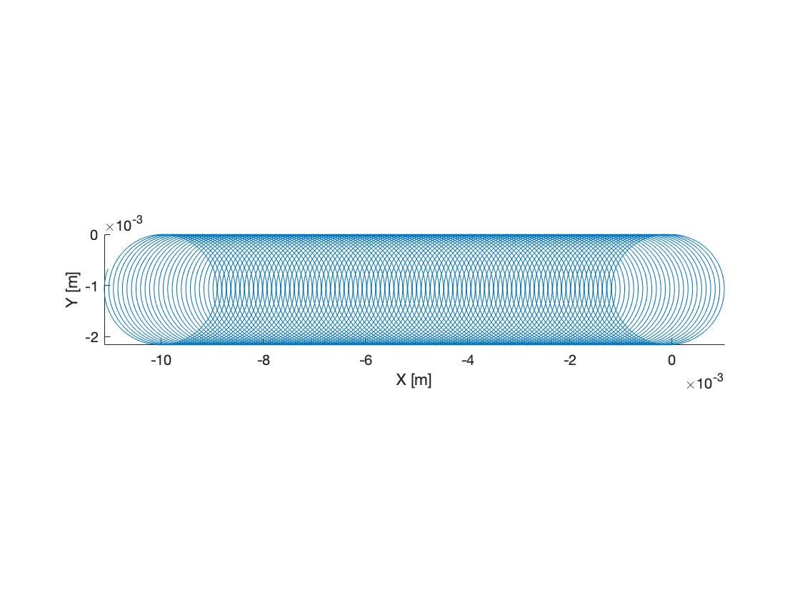

# ExB Drift
GITR needs to accurately simulate the drift motion of ions. ExB (E cross B) is one of those important drifts.

The analytic drift velocity is given: (ExB)/B^2

For this example B = 1 Tesla directed in the z-direction.

E = -100 Volts per meter in the y-direction.

Analytically this gives a drift velocity of 100 m/s in the negative x-direction.

Build the code with the makeGITR_ecrossb.sh script in the build GITR/build folder.

Execute GITR from the e_cross_b_drift folder.

Process the output with the e_cross_b_processing.m matlab script and you will see the following output.

The particle starts with a gyrocenter at x=0 and after 10,000 steps with dt = 1e-8 s the particle gyrocenter has traveled 1 cm in the negative x direction.

