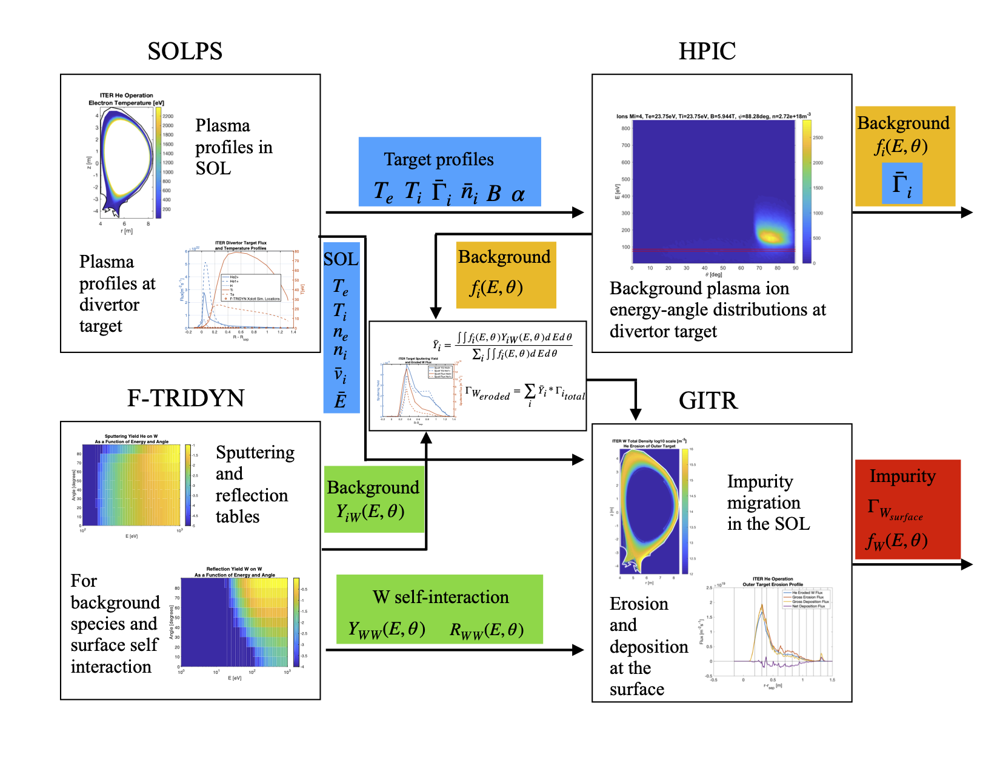

# GITR Setup for 2D ITER geometry and background plasma
This setup folder contains a python script called ```iter_2d_setup.py```

In order to run this script, you first need to make sure the other python libraries are on the ```PYTHONPATH```
```export PYTHONPATH=$PYTHONPATH:/path/to/GITR/python```

Then the ```iter_2d_setup.py``` script can be run:
```python3 iter_2d_setup.py```

This will produce the input needed for GITR based on other code outputs located in the assets foler.
The inputs are then copied into the inputs folder.


